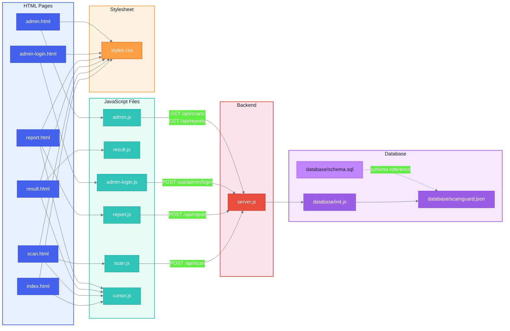

# ScamGuard — System Architecture Flow Diagram

> A complete system architecture flowchart using standard flowchart shapes:
> - **Rounded Rectangle** → Start / End points
> - **Rectangle** → Processes & Components
> - **Diamond** → Decision / Condition
> - **Parallelogram** → Input / Output
> - All shapes are **filled with colors** for clarity.

---

## 1. Complete System Architecture Flow

```mermaid
%%{init: {'theme': 'base', 'themeVariables': {'primaryColor': '#4361ee', 'primaryTextColor': '#fff', 'lineColor': '#4a4a4a', 'background': '#ffffff'}}}%%
flowchart TD
    START(["🌐 User Opens ScamGuard Website"])

    HOME["🏠 HOME PAGE\nindex.html\nWelcome Screen with Navigation"]

    DECIDE{"🤔 What does the\nuser want to do?"}

    %% ===== SCAN FLOW =====
    SCAN_PAGE["🔍 SCAN PAGE\nscan.html\nJob Details Input Form"]
    SCAN_INPUT[/"📥 User Enters:\n• Job Title\n• Company Name\n• Contact Email\n• Salary\n• Description\n• Payment Required?"/]
    SCAN_SUBMIT["📤 Submit Form\nPOST /api/scan"]
    SERVER_SCAN["⚙️ EXPRESS SERVER\nReceives Job Data"]
    RISK_ENGINE["🧠 RISK ANALYSIS ENGINE\nRule-Based Scam Detection"]

    %% Risk Checks
    CHECK_PAY{"💰 Payment\nRequired?"}
    CHECK_EMAIL{"📧 Free Email\nDomain?"}
    CHECK_KEYWORDS{"🔑 Suspicious\nKeywords Found?"}
    CHECK_SALARY{"💵 Unrealistic\nSalary?"}

    SCORE_CALC["📊 CALCULATE\nTOTAL RISK SCORE"]

    RISK_DECIDE{"📊 Risk Score\nLevel?"}

    HIGH_RISK["🔴 HIGH RISK\nScore ≥ 40\nLikely a Scam!"]
    MED_RISK["🟡 MEDIUM RISK\nScore 20–39\nProceed with Caution"]
    LOW_RISK["🟢 LOW RISK\nScore < 20\nAppears Legitimate"]

    DB_SAVE_SCAN[("💾 DATABASE\nSave to job_scans\nscamguard.json")]

    RESULT_PAGE["📊 RESULT PAGE\nresult.html\nDisplay Risk Level"]

    AFTER_RESULT{"👤 User's\nNext Action?"}

    %% ===== REPORT FLOW =====
    REPORT_PAGE["📝 REPORT PAGE\nreport.html\nScam Report Form"]
    REPORT_INPUT[/"📥 User Enters:\n• Reporter Name\n• Reporter Email\n• Scam Description"/]
    REPORT_SUBMIT["📤 Submit Report\nPOST /api/report"]
    SERVER_REPORT["⚙️ EXPRESS SERVER\nReceives Report Data"]
    DB_SAVE_REPORT[("💾 DATABASE\nSave to scam_reports\nStatus: Pending")]
    REPORT_CONFIRM["✅ CONFIRMATION\nReport Submitted\nSuccessfully"]

    %% ===== ADMIN FLOW =====
    ADMIN_LOGIN["🔐 ADMIN LOGIN PAGE\nadmin-login.html\nCredentials Form"]
    ADMIN_INPUT[/"📥 Admin Enters:\n• Username\n• Password"/]
    AUTH_SUBMIT["📤 Submit Login\nPOST /api/admin/login"]
    SERVER_AUTH["⚙️ EXPRESS SERVER\nAuthentication Module"]
    AUTH_CHECK{"🔒 Credentials\nValid?"}
    AUTH_FAIL["❌ LOGIN FAILED\nInvalid Credentials\nShow Error Message"]
    ADMIN_DASH["📋 ADMIN DASHBOARD\nadmin.html\nControl Panel"]
    FETCH_DATA["⚙️ FETCH ALL DATA\nGET /api/scans\nGET /api/reports"]
    DB_READ[("💾 DATABASE\nRead job_scans\nRead scam_reports")]
    ADMIN_VIEW["📋 DISPLAY DATA\n• All Job Scans Table\n• All Reports Table\n• Statistics & Counts"]

    END_SESSION(["🔚 Session Complete"])

    %% ===== CONNECTIONS =====
    START --> HOME
    HOME --> DECIDE

    DECIDE -- "Check a Job" --> SCAN_PAGE
    DECIDE -- "Report a Scam" --> REPORT_PAGE
    DECIDE -- "Admin Login" --> ADMIN_LOGIN

    %% Scan Flow
    SCAN_PAGE --> SCAN_INPUT
    SCAN_INPUT --> SCAN_SUBMIT
    SCAN_SUBMIT --> SERVER_SCAN
    SERVER_SCAN --> RISK_ENGINE

    RISK_ENGINE --> CHECK_PAY
    CHECK_PAY -- "Yes → +50 pts" --> CHECK_EMAIL
    CHECK_PAY -- "No → +0 pts" --> CHECK_EMAIL
    CHECK_EMAIL -- "Yes → +20 pts" --> CHECK_KEYWORDS
    CHECK_EMAIL -- "No → +0 pts" --> CHECK_KEYWORDS
    CHECK_KEYWORDS -- "Found → +5 pts each" --> CHECK_SALARY
    CHECK_KEYWORDS -- "None → +0 pts" --> CHECK_SALARY
    CHECK_SALARY -- "Yes → +15 pts" --> SCORE_CALC
    CHECK_SALARY -- "No → +0 pts" --> SCORE_CALC

    SCORE_CALC --> DB_SAVE_SCAN
    DB_SAVE_SCAN --> RISK_DECIDE

    RISK_DECIDE -- "Score ≥ 40" --> HIGH_RISK
    RISK_DECIDE -- "Score 20–39" --> MED_RISK
    RISK_DECIDE -- "Score < 20" --> LOW_RISK

    HIGH_RISK --> RESULT_PAGE
    MED_RISK --> RESULT_PAGE
    LOW_RISK --> RESULT_PAGE

    RESULT_PAGE --> AFTER_RESULT
    AFTER_RESULT -- "Scan Another Job" --> SCAN_PAGE
    AFTER_RESULT -- "Report This Job" --> REPORT_PAGE
    AFTER_RESULT -- "Done" --> END_SESSION

    %% Report Flow
    REPORT_PAGE --> REPORT_INPUT
    REPORT_INPUT --> REPORT_SUBMIT
    REPORT_SUBMIT --> SERVER_REPORT
    SERVER_REPORT --> DB_SAVE_REPORT
    DB_SAVE_REPORT --> REPORT_CONFIRM
    REPORT_CONFIRM --> END_SESSION

    %% Admin Flow
    ADMIN_LOGIN --> ADMIN_INPUT
    ADMIN_INPUT --> AUTH_SUBMIT
    AUTH_SUBMIT --> SERVER_AUTH
    SERVER_AUTH --> AUTH_CHECK
    AUTH_CHECK -- "No" --> AUTH_FAIL
    AUTH_FAIL --> ADMIN_LOGIN
    AUTH_CHECK -- "Yes" --> ADMIN_DASH
    ADMIN_DASH --> FETCH_DATA
    FETCH_DATA --> DB_READ
    DB_READ --> ADMIN_VIEW
    ADMIN_VIEW --> END_SESSION

    %% ===== STYLES =====
    style START fill:#4361ee,stroke:#3250d3,color:#fff,stroke-width:2px
    style HOME fill:#4361ee,stroke:#3250d3,color:#fff,stroke-width:2px
    style DECIDE fill:#ffeaa7,stroke:#fdcb6e,color:#2d3436,stroke-width:2px
    style SCAN_PAGE fill:#2ec4b6,stroke:#1ea898,color:#fff,stroke-width:2px
    style SCAN_INPUT fill:#38d9a9,stroke:#20c997,color:#1a1a2e,stroke-width:2px
    style SCAN_SUBMIT fill:#2ec4b6,stroke:#1ea898,color:#fff,stroke-width:2px
    style SERVER_SCAN fill:#6c757d,stroke:#545b62,color:#fff,stroke-width:2px
    style RISK_ENGINE fill:#ff9f43,stroke:#ee5a24,color:#fff,stroke-width:2px
    style CHECK_PAY fill:#ffeaa7,stroke:#fdcb6e,color:#2d3436,stroke-width:2px
    style CHECK_EMAIL fill:#ffeaa7,stroke:#fdcb6e,color:#2d3436,stroke-width:2px
    style CHECK_KEYWORDS fill:#ffeaa7,stroke:#fdcb6e,color:#2d3436,stroke-width:2px
    style CHECK_SALARY fill:#ffeaa7,stroke:#fdcb6e,color:#2d3436,stroke-width:2px
    style SCORE_CALC fill:#ff9f43,stroke:#ee5a24,color:#fff,stroke-width:2px
    style RISK_DECIDE fill:#ffeaa7,stroke:#fdcb6e,color:#2d3436,stroke-width:2px
    style HIGH_RISK fill:#e74c3c,stroke:#c0392b,color:#fff,stroke-width:2px
    style MED_RISK fill:#f39c12,stroke:#d68910,color:#fff,stroke-width:2px
    style LOW_RISK fill:#2ecc71,stroke:#27ae60,color:#fff,stroke-width:2px
    style DB_SAVE_SCAN fill:#9b5de5,stroke:#7c3aed,color:#fff,stroke-width:2px
    style RESULT_PAGE fill:#ff9f43,stroke:#ee5a24,color:#fff,stroke-width:2px
    style AFTER_RESULT fill:#ffeaa7,stroke:#fdcb6e,color:#2d3436,stroke-width:2px
    style REPORT_PAGE fill:#e74c3c,stroke:#c0392b,color:#fff,stroke-width:2px
    style REPORT_INPUT fill:#ff6b6b,stroke:#ee5a52,color:#fff,stroke-width:2px
    style REPORT_SUBMIT fill:#e74c3c,stroke:#c0392b,color:#fff,stroke-width:2px
    style SERVER_REPORT fill:#6c757d,stroke:#545b62,color:#fff,stroke-width:2px
    style DB_SAVE_REPORT fill:#9b5de5,stroke:#7c3aed,color:#fff,stroke-width:2px
    style REPORT_CONFIRM fill:#2ecc71,stroke:#27ae60,color:#fff,stroke-width:2px
    style ADMIN_LOGIN fill:#9b5de5,stroke:#7c3aed,color:#fff,stroke-width:2px
    style ADMIN_INPUT fill:#c084fc,stroke:#a855f7,color:#1a1a2e,stroke-width:2px
    style AUTH_SUBMIT fill:#9b5de5,stroke:#7c3aed,color:#fff,stroke-width:2px
    style SERVER_AUTH fill:#6c757d,stroke:#545b62,color:#fff,stroke-width:2px
    style AUTH_CHECK fill:#ffeaa7,stroke:#fdcb6e,color:#2d3436,stroke-width:2px
    style AUTH_FAIL fill:#e74c3c,stroke:#c0392b,color:#fff,stroke-width:2px
    style ADMIN_DASH fill:#2ecc71,stroke:#27ae60,color:#fff,stroke-width:2px
    style FETCH_DATA fill:#6c757d,stroke:#545b62,color:#fff,stroke-width:2px
    style DB_READ fill:#9b5de5,stroke:#7c3aed,color:#fff,stroke-width:2px
    style ADMIN_VIEW fill:#9b5de5,stroke:#7c3aed,color:#fff,stroke-width:2px
    style END_SESSION fill:#4361ee,stroke:#3250d3,color:#fff,stroke-width:2px
```

---

## 2. Layered System Architecture

```mermaid
%%{init: {'theme': 'base', 'themeVariables': {'primaryColor': '#4361ee', 'primaryTextColor': '#fff', 'lineColor': '#4a4a4a', 'background': '#ffffff'}}}%%
flowchart TD
    subgraph PRESENTATION["PRESENTATION LAYER — Frontend"]
        direction LR
        INDEX["🏠 index.html\nHome Page"]
        SCAN["🔍 scan.html\nJob Scan Form"]
        RESULT["📊 result.html\nRisk Results"]
        REPORT["📝 report.html\nReport Form"]
        ADMIN_L["🔐 admin-login.html\nLogin Page"]
        ADMIN_D["📋 admin.html\nDashboard"]
        STYLES["🎨 styles.css\nAll Styling"]
    end

    subgraph LOGIC["CLIENT-SIDE LOGIC LAYER — JavaScript"]
        direction LR
        SCAN_JS["scan.js\nForm Validation\nData Submission"]
        RESULT_JS["result.js\nDisplay Results\nRisk Visualization"]
        REPORT_JS["report.js\nReport Validation\nSubmission"]
        ADMIN_JS["admin.js\nDashboard Logic\nData Fetching"]
        ADMIN_LJS["admin-login.js\nAuthentication\nSession Handling"]
        CURSOR_JS["cursor.js\nUI Animations\nCursor Effects"]
    end

    subgraph SERVER_LAYER["SERVER LAYER — Backend"]
        direction LR
        SERVER["⚙️ server.js\nExpress.js Server\nPort 3000"]
        API_SCAN["/api/scan\nPOST — Analyze Job"]
        API_REPORT["/api/report\nPOST — Submit Report"]
        API_ADMIN_AUTH["/api/admin/login\nPOST — Admin Login"]
        API_GET_SCANS["/api/scans\nGET — All Scan Records"]
        API_GET_REPORTS["/api/reports\nGET — All Reports"]
    end

    subgraph DATA_LAYER["DATA LAYER — Storage"]
        direction LR
        LOWDB["LowDB v1.0.0\nJSON File Database"]
        JSON_FILE["scamguard.json\nPersistent Storage"]
        SCHEMA["schema.sql\nDatabase Schema\nReference"]
        INIT["init.js\nDatabase\nInitialization"]
    end

    subgraph CONFIG["CONFIGURATION & DEPLOYMENT"]
        direction LR
        PKG["package.json\nDependencies\n& Scripts"]
        DOCKER["Dockerfile\nContainer\nConfiguration"]
        RENDER_YAML["render.yaml\nCloud Deployment\nConfig"]
        NGROK["start-ngrok.bat\nPublic URL\nTunneling"]
    end

    %% Connections
    PRESENTATION --> LOGIC
    LOGIC --> SERVER_LAYER
    SERVER_LAYER --> DATA_LAYER
    CONFIG -. "configures" .-> SERVER_LAYER

    %% Styles
    style PRESENTATION fill:#e8f0fe,stroke:#4361ee,stroke-width:3px,color:#1a1a2e
    style LOGIC fill:#e6fcf5,stroke:#2ec4b6,stroke-width:3px,color:#1a1a2e
    style SERVER_LAYER fill:#fff3e0,stroke:#ff9f43,stroke-width:3px,color:#1a1a2e
    style DATA_LAYER fill:#f3e8ff,stroke:#9b5de5,stroke-width:3px,color:#1a1a2e
    style CONFIG fill:#fce4ec,stroke:#e74c3c,stroke-width:3px,color:#1a1a2e

    style INDEX fill:#4361ee,stroke:#3250d3,color:#fff
    style SCAN fill:#3a86ff,stroke:#2e6ed9,color:#fff
    style RESULT fill:#ff9f43,stroke:#ee5a24,color:#fff
    style REPORT fill:#e74c3c,stroke:#c0392b,color:#fff
    style ADMIN_L fill:#6c757d,stroke:#545b62,color:#fff
    style ADMIN_D fill:#2ecc71,stroke:#27ae60,color:#fff
    style STYLES fill:#3498db,stroke:#2980b9,color:#fff

    style SCAN_JS fill:#2ec4b6,stroke:#1ea898,color:#fff
    style RESULT_JS fill:#38d9a9,stroke:#20c997,color:#1a1a2e
    style REPORT_JS fill:#2ec4b6,stroke:#1ea898,color:#fff
    style ADMIN_JS fill:#38d9a9,stroke:#20c997,color:#1a1a2e
    style ADMIN_LJS fill:#2ec4b6,stroke:#1ea898,color:#fff
    style CURSOR_JS fill:#38d9a9,stroke:#20c997,color:#1a1a2e

    style SERVER fill:#ff9f43,stroke:#ee5a24,color:#fff
    style API_SCAN fill:#ff9f43,stroke:#ee5a24,color:#fff
    style API_REPORT fill:#ff9f43,stroke:#ee5a24,color:#fff
    style API_ADMIN_AUTH fill:#ff9f43,stroke:#ee5a24,color:#fff
    style API_GET_SCANS fill:#ff9f43,stroke:#ee5a24,color:#fff
    style API_GET_REPORTS fill:#ff9f43,stroke:#ee5a24,color:#fff

    style LOWDB fill:#9b5de5,stroke:#7c3aed,color:#fff
    style JSON_FILE fill:#c084fc,stroke:#a855f7,color:#1a1a2e
    style SCHEMA fill:#c084fc,stroke:#a855f7,color:#1a1a2e
    style INIT fill:#9b5de5,stroke:#7c3aed,color:#fff

    style PKG fill:#e74c3c,stroke:#c0392b,color:#fff
    style DOCKER fill:#e74c3c,stroke:#c0392b,color:#fff
    style RENDER_YAML fill:#e74c3c,stroke:#c0392b,color:#fff
    style NGROK fill:#e74c3c,stroke:#c0392b,color:#fff
```

---

## 3. File-to-File Dependency Map

---

## Shape Legend

| Shape | Mermaid Syntax | Meaning |
|-------|---------------|---------|
| **Rounded Rectangle** | `(["text"])` | Start / End |
| **Rectangle** | `["text"]` | Process / Component |
| **Diamond** | `{"text"}` | Decision / Condition |
| **Parallelogram** | `[/"text"/]` | Input / Output |
| **Cylinder** | `[("text")]` | Database / Storage |
| **Subgraph** | `subgraph` | Grouped Layer |
