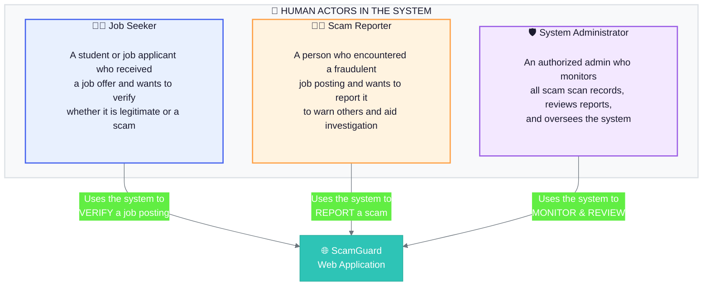
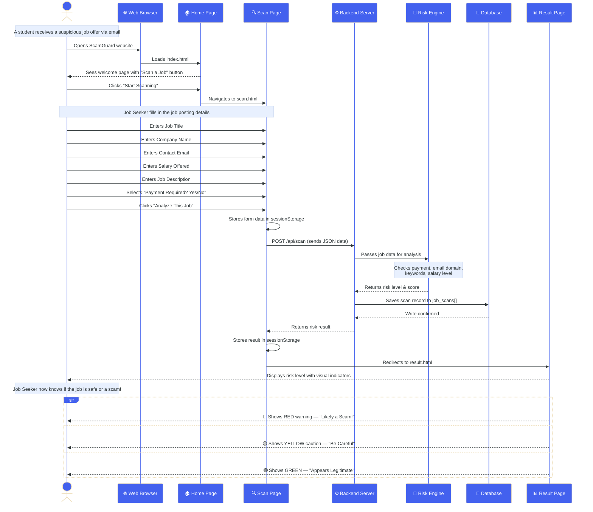
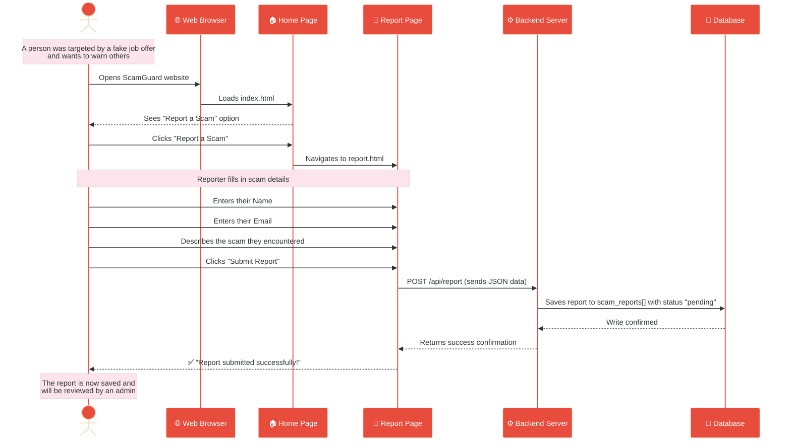
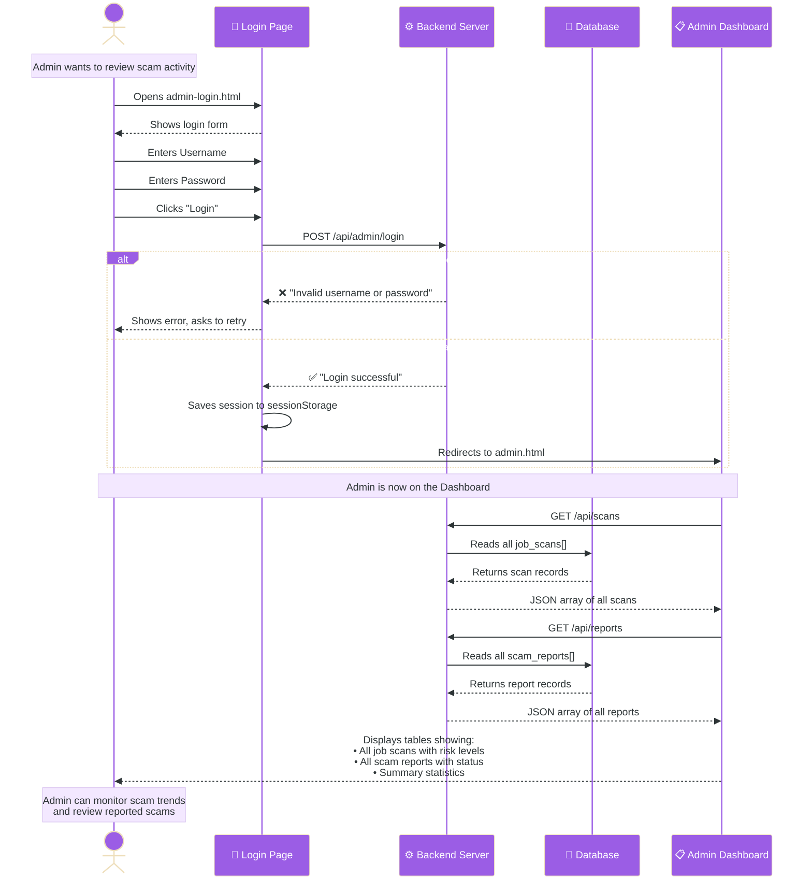
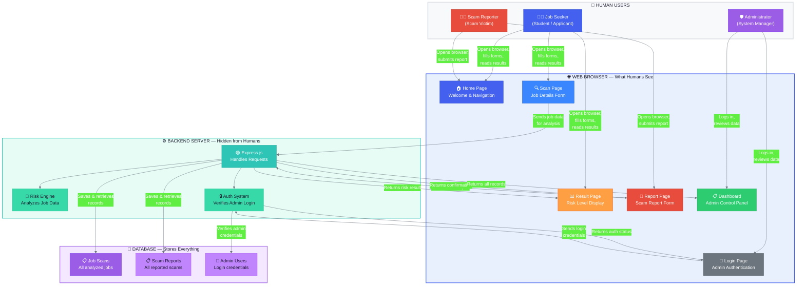
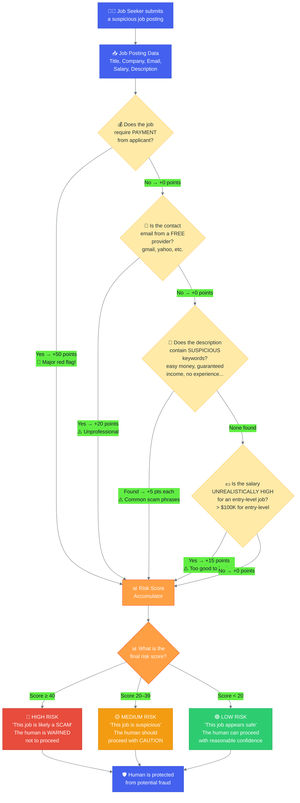
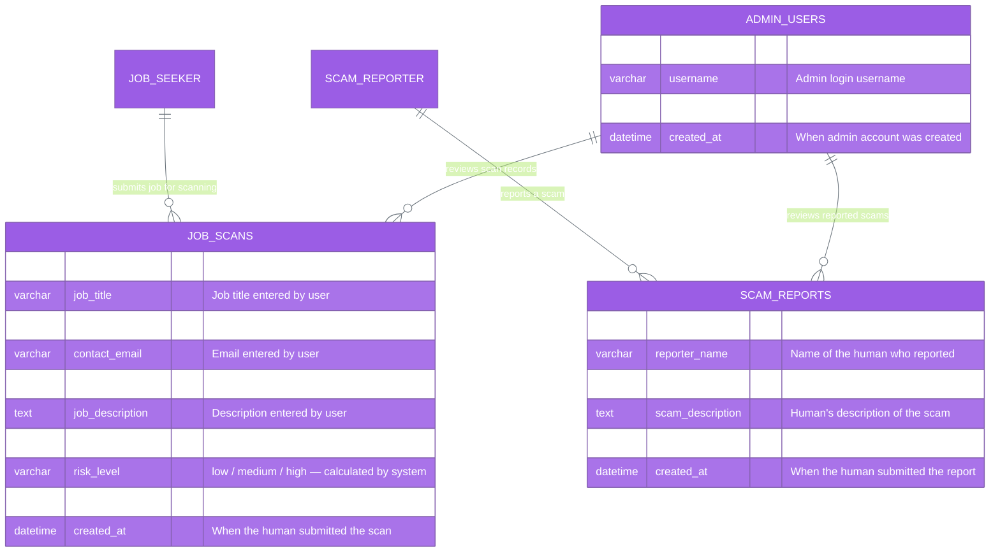
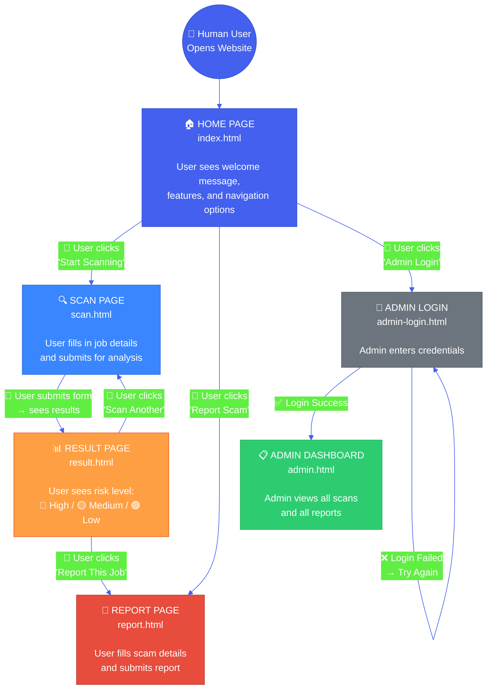
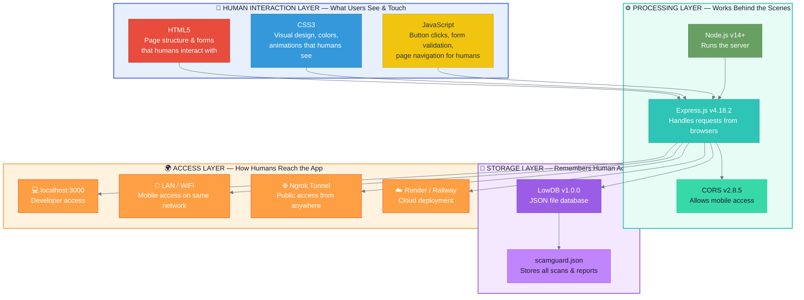

# ScamGuard — Human-Based System Architecture

> This document presents the system architecture from the **human perspective** — showing how real people interact with the web application, what they see, what they do, and how the system responds at every step.

---

## 1. Human Actors & Their Roles

---

## 2. Complete Web Flow — Human Journey Through the Application

```mermaid
%%{init: {'theme': 'base', 'themeVariables': {'primaryColor': '#4361ee', 'primaryTextColor': '#fff', 'lineColor': '#4361ee', 'background': '#ffffff'}}}%%
flowchart TD
    START(("🧑 Human User\nOpens the Website")) --> HOME

    subgraph HOME_SECTION["🏠 HOME PAGE — index.html"]
        HOME["User lands on the Home Page\nSees introduction, features,\nand call-to-action buttons"]
    end

    HOME --> DECIDE{"🤔 What does the\nuser want to do?"}

    DECIDE -- "Check a Job Posting" --> SCAN_SECTION
    DECIDE -- "Report a Scam" --> REPORT_SECTION
    DECIDE -- "Admin Login" --> ADMIN_SECTION

    subgraph SCAN_SECTION["🔍 JOB SCAN FLOW — Job Seeker Journey"]
        direction TB
        SCAN_PAGE["User opens scan.html\nSees the Job Details Form"]
        SCAN_FILL["User fills in:\n• Job Title\n• Company Name\n• Contact Email\n• Salary Offered\n• Job Description\n• Payment Required?"]
        SCAN_SUBMIT["User clicks 'Analyze Job'\nForm data is sent to server"]
        SCAN_PROCESS["⚙️ Server receives data\n🧠 Risk Engine analyzes:\n  → Payment required?\n  → Free email domain?\n  → Suspicious keywords?\n  → Unrealistic salary?"]
        SCAN_RESULT["User is redirected to\nresult.html — sees the outcome"]

        SCAN_PAGE --> SCAN_FILL --> SCAN_SUBMIT --> SCAN_PROCESS --> SCAN_RESULT
    end

    subgraph RESULT_SECTION["📊 RESULT DISPLAY — What the User Sees"]
        direction TB
        RESULT_HIGH["🔴 HIGH RISK\nUser sees a RED warning\n'This job appears to be a SCAM'\nScore ≥ 40"]
        RESULT_MED["🟡 MEDIUM RISK\nUser sees a YELLOW caution\n'Proceed with caution'\nScore 20–39"]
        RESULT_LOW["🟢 LOW RISK\nUser sees a GREEN approval\n'This job appears legitimate'\nScore < 20"]
    end

    SCAN_RESULT --> RESULT_HIGH
    SCAN_RESULT --> RESULT_MED
    SCAN_RESULT --> RESULT_LOW

    RESULT_HIGH --> USER_ACTION_1{"👤 User decides\nnext action"}
    RESULT_MED --> USER_ACTION_1
    RESULT_LOW --> USER_ACTION_1

    USER_ACTION_1 -- "Scan Another Job" --> SCAN_PAGE
    USER_ACTION_1 -- "Report This Job" --> REPORT_PAGE

    subgraph REPORT_SECTION["📝 REPORT SCAM FLOW — Reporter Journey"]
        direction TB
        REPORT_PAGE["User opens report.html\nSees the Report Form"]
        REPORT_FILL["User fills in:\n• Reporter Name\n• Reporter Email\n• Scam Description"]
        REPORT_SUBMIT["User clicks 'Submit Report'\nReport is sent to server"]
        REPORT_CONFIRM["✅ User sees confirmation\n'Report submitted successfully'\nStatus: Pending Review"]

        REPORT_PAGE --> REPORT_FILL --> REPORT_SUBMIT --> REPORT_CONFIRM
    end

    subgraph ADMIN_SECTION["🛡️ ADMIN FLOW — Administrator Journey"]
        direction TB
        ADMIN_LOGIN["Admin opens admin-login.html\nSees login form"]
        ADMIN_CREDS["Admin enters:\n• Username\n• Password"]
        ADMIN_AUTH{"🔐 Server verifies\ncredentials"}
        ADMIN_FAIL["❌ Invalid credentials\nUser sees error message\nAsked to try again"]
        ADMIN_DASH["✅ Login successful\nRedirected to admin.html\nAdmin Dashboard"]
        ADMIN_VIEW["Admin can view:\n📋 All Job Scans — with risk levels\n📋 All Scam Reports — with status\n📊 Statistics & Counts"]

        ADMIN_LOGIN --> ADMIN_CREDS --> ADMIN_AUTH
        ADMIN_AUTH -- "Wrong credentials" --> ADMIN_FAIL --> ADMIN_LOGIN
        ADMIN_AUTH -- "Correct credentials" --> ADMIN_DASH --> ADMIN_VIEW
    end

    style START fill:#4361ee,stroke:#3250d3,color:#fff
    style HOME fill:#4361ee,stroke:#3250d3,color:#fff
    style DECIDE fill:#ffeaa7,stroke:#fdcb6e,color:#2d3436
    style HOME_SECTION fill:#e8f0fe,stroke:#4361ee,stroke-width:2px,color:#1a1a2e
    style SCAN_SECTION fill:#e6fcf5,stroke:#2ec4b6,stroke-width:2px,color:#1a1a2e
    style RESULT_SECTION fill:#fff8e1,stroke:#ff9f43,stroke-width:2px,color:#1a1a2e
    style REPORT_SECTION fill:#fce4ec,stroke:#e74c3c,stroke-width:2px,color:#1a1a2e
    style ADMIN_SECTION fill:#f3e8ff,stroke:#9b5de5,stroke-width:2px,color:#1a1a2e
    style SCAN_PAGE fill:#2ec4b6,stroke:#1ea898,color:#fff
    style SCAN_FILL fill:#38d9a9,stroke:#20c997,color:#1a1a2e
    style SCAN_SUBMIT fill:#2ec4b6,stroke:#1ea898,color:#fff
    style SCAN_PROCESS fill:#ff9f43,stroke:#ee5a24,color:#fff
    style SCAN_RESULT fill:#ff9f43,stroke:#ee5a24,color:#fff
    style RESULT_HIGH fill:#e74c3c,stroke:#c0392b,color:#fff
    style RESULT_MED fill:#f39c12,stroke:#d68910,color:#fff
    style RESULT_LOW fill:#2ecc71,stroke:#27ae60,color:#fff
    style USER_ACTION_1 fill:#ffeaa7,stroke:#fdcb6e,color:#2d3436
    style REPORT_PAGE fill:#e74c3c,stroke:#c0392b,color:#fff
    style REPORT_FILL fill:#ff6b6b,stroke:#ee5a52,color:#fff
    style REPORT_SUBMIT fill:#e74c3c,stroke:#c0392b,color:#fff
    style REPORT_CONFIRM fill:#2ecc71,stroke:#27ae60,color:#fff
    style ADMIN_LOGIN fill:#9b5de5,stroke:#7c3aed,color:#fff
    style ADMIN_CREDS fill:#c084fc,stroke:#a855f7,color:#1a1a2e
    style ADMIN_AUTH fill:#ffeaa7,stroke:#fdcb6e,color:#2d3436
    style ADMIN_FAIL fill:#e74c3c,stroke:#c0392b,color:#fff
    style ADMIN_DASH fill:#2ecc71,stroke:#27ae60,color:#fff
    style ADMIN_VIEW fill:#9b5de5,stroke:#7c3aed,color:#fff
```

---

## 3. Job Seeker's Experience — Step-by-Step Sequence

---

## 4. Scam Reporter's Experience — Step-by-Step Sequence

---

## 5. Admin's Experience — Step-by-Step Sequence

---

## 6. How the System Works — Human-Centered Architecture

---

## 7. Risk Analysis — How the System Protects Humans

---

## 8. Data Flow — What Gets Stored About Human Activity

---

## 9. Page Navigation — Human's Path Through the Website

---

## 10. Technology Stack — What Powers the Human Experience

